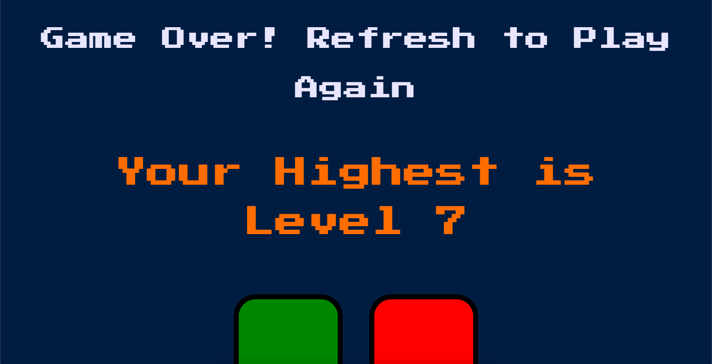

# Simon Game
A simple yet fun memory game of colors and tunes. The game creates a series of tones and lights and requires a user to repeat the sequence.

# Description
Simon is an electronic game that tests the memory skills of the player. It was invented by Ralph H. Baer and Howard J. Morrison and introduced by Milton Bradley in 1978. The game consists of a console with four colored buttons (red, blue, green, and yellow) that light up and emit a unique tone when pressed.

The game starts with the console emitting a sequence of tones and lighting up the corresponding buttons in a specific order. The player must then repeat the sequence by pressing the buttons in the same order as they were lit up. Each successful sequence increases the length of the pattern, making the game progressively more challenging.

If the player makes a mistake or takes too long to repeat the sequence, the game ends, and the player's score is displayed. The game can be played alone or with others, with each player taking turns to repeat the pattern.

# Screenshots

